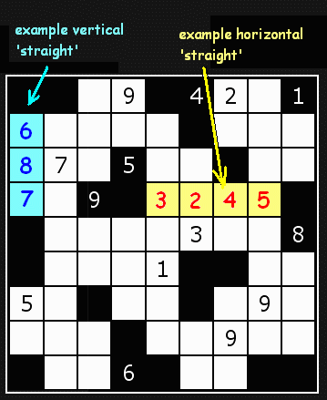
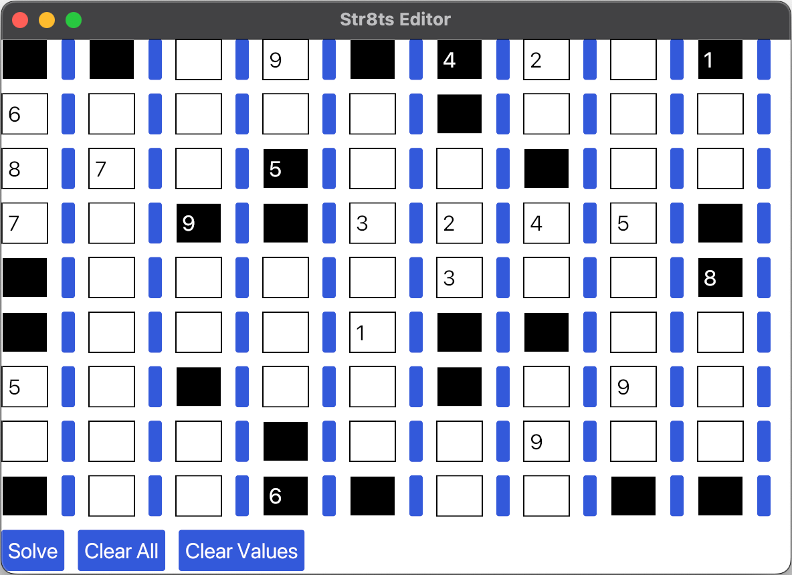

# Russtr8ts
A linear programming based solver for the game [str8ts](https://www.str8ts.com/).

## Dependencies
`russtr8ts` utilizes the safe Rust interface of the [SCIP](https://www.scipopt.org/index.php#download) mixed integer programming solver, called [`russcip`](https://github.com/scipopt/russcip). As of creation of this repository, an installation of `russcip` does not come with an installation of the underlying C-library `SCIP`. Therefore, it is required to install `SCIP` manually. For more detailed and up-to-date information on how to do this I refer to the [`russcip` repository](https://github.com/scipopt/russcip), but for beginners a simple installation through anaconda should suffice:
```bash
conda install --channel conda-forge scip
```

## Usage
When running `russtr8ts`, one is presented with a rudimentary graphical editor for the str8ts game. Using this interface, we can create a str8ts puzzle and have it solved by a simple click of a button.

For instance, we can take the puzzle from the [str8ts tutorial](https://www.str8ts.com/str8ts)

...input it into the editor by entering the numbers in the corresponding cells and toggling their color using the blue button next to each cell

...and solve it by clicking the `Solve` button:

